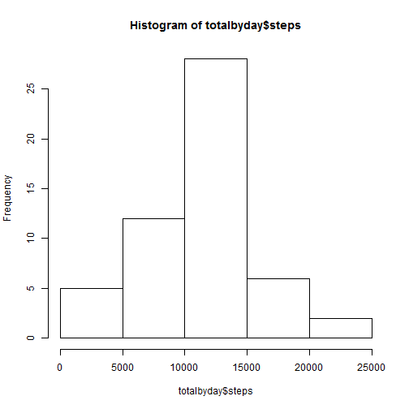

# Reproducible Research: Peer Assessment 1

## Loading and preprocessing the data

Download and unzip the file

```r
setInternet2(use = TRUE)
temp <- tempfile()
download.file("https://d396qusza40orc.cloudfront.net/repdata%2Fdata%2Factivity.zip",temp)
data <- read.csv(unz(temp, "activity.csv"), na.strings="NA")
unlink(temp)
```

convert "date" to a date field

```r
data$date=as.Date(data$date)
```

Add leading zero's to the interval field

```r
data$interval=formatC(data$interval, width=4, format="d", flag="0")
```

Add a column that is the date and time (interval plus date in datetime format)

```r
data$time <- strptime(paste(data$date, data$interval), format = "%Y-%m-%d %H%M")
```

## What is mean total number of steps taken per day?

Create a total of steps by day, then plot the histogram

```r
totalbyday=aggregate(steps~date, data, FUN=sum)
hist(totalbyday$steps)
```

 

Calculate the mean number of steps per day

```r
mean(totalbyday$steps)
```

```
## [1] 10766
```

Calculate the median number of steps per day

```r
median(totalbyday$steps)
```

```
## [1] 10765
```

## What is the average daily activity pattern?
Create average steps by interval

```r
avgsteps=aggregate(steps~interval, data, FUN=mean)
plot(avgsteps$interval, avgsteps$steps, type="l")
```

 

Calculate the 5 Minute interval with the highest number of average steps

```r
avgsteps[(which.max(avgsteps$steps)),]
```

```
##     interval steps
## 104     0835 206.2
```


## Imputing missing values
Ttotal number of rows with NAs

```r
data$isNA=is.na(data$steps)
sum(data$isNA)
```

```
## [1] 2304
```

Imputing missing data

```r
imputed=merge(x=data, y=avgsteps, by="interval", all.x=TRUE)
imputed$imp=ifelse(is.na(imputed$steps.x), imputed$steps.y, imputed$steps.x)
```

Redo Histogram, mean and median with the imputed values
Create a total of steps by day, then plot the histogram

```r
totalbydayImp=aggregate(imp~date, imputed, FUN=sum)
hist(totalbydayImp$imp)
```

 

Calculate the mean number of steps per day

```r
mean(totalbydayImp$imp)
```

```
## [1] 10766
```

Calculate the median number of steps per day

```r
median(totalbydayImp$imp)
```

```
## [1] 10766
```


## Are there differences in activity patterns between weekdays and weekends?


```r
#Redo Histogram, mean and median with the imputed values
#Create a total of steps by day, then plot the histogram
totalbydayImp=aggregate(imp~date, imputed, FUN=sum)
hist(totalbydayImp$imp)

#Calculate the mean number of steps per day
mean(totalbydayImp$imp)
```

```
## [1] 10766
```

```r
#Calculate the median number of steps per day
median(totalbydayImp$imp)
```

```
## [1] 10766
```

```r
#Add a column to determine if the date is a weekday or weekend
#First figure the day of the week
data$day=weekdays(data$date)
#then determine if that day is a weekday
data$weekdays=ifelse((data$day %in% c("Monday","Tuesday", "Wednesday", "Thursday", "Friday")),"Weekday", "Weekend")
#Now make it a factor variable
data$weekdays=as.factor(data$weekdays)


library("lattice")
```

 

```r
weekday=subset(data, data$weekdays=="Weekday")
weekend=subset(data, data$weekdays=="Weekend")

#Create the plots (just used the base plotting system so it is not as fancy as lattice, but does show both line graphs)
par(mfrow=c(2,1))
avgstepsWD=aggregate(steps~interval, weekday, FUN=mean)
avgstepsWE=aggregate(steps~interval, weekend, FUN=mean)
plot(avgstepsWD$interval, avgstepsWD$steps, type="l")
plot(avgstepsWE$interval, avgstepsWE$steps, type="l")
```

 
